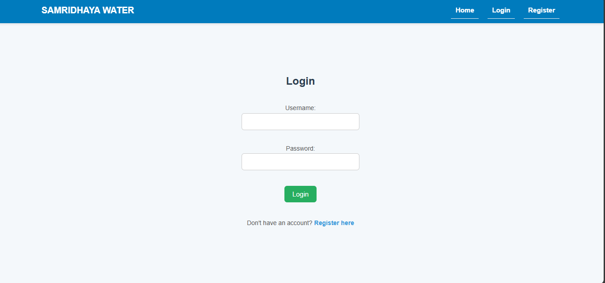

#  Water Management Project (Django)

A Django-based web application for managing water bottle orders for restaurants.  
This system allows users to place orders and download invoices, while admins can track and update order statuses.

---

##  Features

###  User
- Register & login securely  
- Manage profile  
- Place water bottle orders  
- Download PDF invoices  
- Track order status (Pending / Processing / Completed)  

###  Admin
- View all restaurant orders  
- Update order statuses in real-time  
- Access user order history  

---

##  How It Works
1. Users register & log in.  
2. They place an order for water bottles.  
3. An invoice is generated automatically (PDF).  
4. Admin reviews orders from the dashboard.  
5. Admin updates the order status → instantly reflected in the user’s dashboard.  

---

##  Screenshots

###  Register Page

###  Login Page

###  Place Order

###  My Orders

###  Invoice

###  Admin Panel

